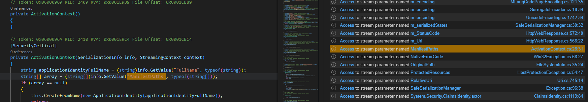

<div align="center" style="font-size: 148px;">
  🧙‍♂️
</div>

<h1 align="center">
  QLinspector: C#
</h1>

<p align="center">
   Finding C# gadget chains with CodeQL.
</p>

<p align="center">
<a href="#installation">Installation</a> &nbsp;&bull;&nbsp;
<a href="#usage">Usage</a> &nbsp;&bull;&nbsp;
<a href="#queries">Queries</a> &nbsp;&bull;&nbsp;
<a href="#acknowledgements">Acknowledgements</a>
</p>

<br />

# Installation

```sh
$ git clone https://github.com/synacktiv/QLinspector.git
$ codeql database analyze System.Web --format=sarif-latest --output=System.Web.sarif --search-path=./QLinspector/ synacktiv/qlinspector-csharp-queries
```

# Usage

### Basic usage

You can run this command it will launch `Qlinspector.ql` and `DangerousTypeFinder.ql`:
```sh
$ codeql database analyze System.Web --format=sarif-latest --output=System.Web.sarif --search-path=./QLinspector/ synacktiv/qlinspector-csharp-queries
```

### Advanced usage

[Here](../../scripts/powershell-ql-helpers.ps1) you can find some powershell helpers to automate the process of searching gadgets in multiple DLLs.

> [!NOTE]
> JQ must be downloaded for this.

1) Initialize some global variables:
```powershell
PS F:\> . ./scripts/powershell-ql-helpers.ps1
PS F:\> Set-CodeQLGlobalPaths -DnSpyExCliPath ... -DnSpyOut ... -CodeQLPath ... -CodeQLDbOut ... -QueryPath ./ql/csharp/queries/ -SarifOut ... -JQPath ...
```

1) Gather all dotnet DLLs from a specific path:
```powershell
PS F:\> Export-DotNetDlls -RootFolder "C:\Windows\Microsoft.NET\assembly\GAC_MSIL\" -DestinationFile "C:\output\assemblies.json"
```

1) Loop over all DLLs and run the gadget queries:
```powershell
PS F:\> Analyze-AllAssemblies -JsonPath "C:\output\assemblies.json"
```

This step will loop over each DLLs and perform the following operations:
- Decompile the DLL with DnSpyEx
- Create a codeql database in build mode none
- Run the gadget queries
- Parse the sarif file and update the json file to add information about the analysis

> [!NOTE]
> `Analyze-DllWithCodeQL` can be used to perform this on a single DLL.

# Queries

## `QLinspector-*.ql`

The main CodeQL query that can be used to find gadget chains.

Here is an example with the `TextFormattingRunProperties` gadget chain:


### Restrictions

To speed analysis you can add a restrictions on the source path via regular expressions:
```ql
predicate isSource(DataFlow::Node source) {
    source instanceof Sources::Source
    and filterSourcePath(source, [".*/my/path/.*", ".*/second/path/.*/Admin.cs"])
  }
```

You can also define a ``GadgetSanitizer`` class and apply restrictions to the node to stop exploration in some cases:
```ql
class AssignableGadgetSanitizer extends GadgetSanitizer {
  AssignableGadgetSanitizer() {
    exists(AssignableMemberAccess acc, AssignableMember m |
      acc.getTarget() = m and
      m.getType().hasFullyQualifiedName("System.Windows.Forms", "Control") and
      this.asExpr() = acc
    )
  }
}
``` 

## `DangerousTypeFinder.ql`

If a type is serializable and extends a dangerous one, it becomes a new gadget. This query finds those types.

Here is an example with the `FormsIdentity` gadget:


## `SerializationInfoPotentialSinkFinder.ql`

Try to identify potential dangerous types by looking at the string used in `Get*` methods of ``SerializationInfo``.

Here is an example:



## `SinkToModel.ql`

Help writing YAML models. Just modify this to generate the model:

```ql
this.getDeclaringType().hasFullyQualifiedName("", "") and
this.hasName("") and
p = this.getAParameter() and 
p.hasName("")
```

Or another way:
```ql
this.getDeclaringType().hasFullyQualifiedName("", "") and
this.hasName("") and
p = this.getParameter(0)
```

# Acknowledgements

- [@chudyPB](https://x.com/chudypb) for his [research](https://github.com/thezdi/presentations/blob/main/2023_Hexacon/whitepaper-net-deser.pdf) at Hexacon.
- [@pwntester](https://x.com/pwntester) for [Ysoserial.net](https://github.com/pwntester/ysoserial.net/)
- [@irsdl](https://x.com/irsdl) for all the research on gadget and dotnet like [this one](https://soroush.me/downloadable/use_of_deserialisation_in_dotnet_framework_methods_and_classes.pdf).
- All the finders of gadgets
- The peoples at CodeQL, always helping in the [discussion tab](https://github.com/github/codeql/discussions).